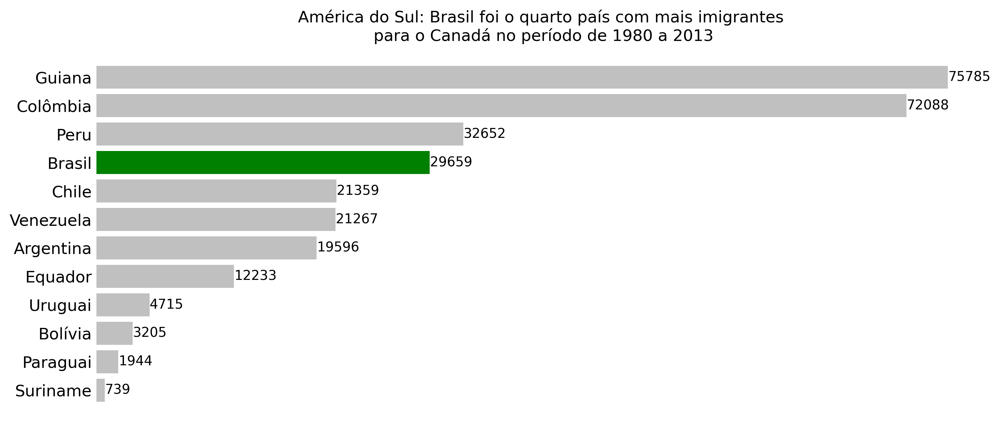

# Análise de Imigrantes Brasileiros no Canadá

Este projeto tem como objetivo analisar o perfil e a evolução dos imigrantes brasileiros no Canadá, utilizando dados históricos e técnicas de análise exploratória em Python.

## Análise Realizada

A análise foi conduzida no Jupyter Notebook [`imigrantes_canada.ipynb`](imigrantes_canada.ipynb). Foram exploradas tendências de imigração ao longo dos anos, distribuição por países da América do Sul, além de visualizações para identificar padrões relevantes sobre a imigração brasileira.

## Base de Dados

A base de dados utilizada, [`imigrantes_canada.csv`](imigrantes_canada.csv), contém informações sobre o número de imigrantes de diversos países para o Canadá, segmentados por ano. Os principais campos incluem país de origem, ano e quantidade de imigrantes.

## Bibliotecas Utilizadas

As principais bibliotecas utilizadas, listadas em [`requirements.txt`](requirements.txt), são:

1. **[pandas](https://pandas.pydata.org/)** - Manipulação e análise de dados.
2. **[numpy](https://numpy.org/)** - Operações numéricas e vetoriais.
3. **[matplotlib](https://matplotlib.org/)** - Visualização de dados.
4. **[seaborn](https://seaborn.pydata.org/)** - Visualização estatística de dados.
5. **[jupyter](https://jupyter.org/)** - Ambiente interativo para notebooks.

## Visualização

